# Technical Implementation Plan — StreamCaster iOS

**Generated:** 2026-03-15
**Source:** IOS_SPECIFICATION.md v2.0 (Hardened)
**Bundle ID:** `com.port80.app`

---

## 1. Delivery Assumptions

### Team Assumptions
- **3–5 contributors** working in parallel (iOS engineers + 1 QA/DevOps).
- Each contributor can own an independent vertical slice.
- No dedicated security engineer; security requirements are embedded in every task with peer review gates.

### Scope Assumptions
- Phase 1 (Core Streaming MVP) and Phase 2 (Settings & Configuration) are the primary delivery targets.
- Phase 3 (Resilience & Polish) follows immediately; Phase 4 is secondary.
- Phase 5 (Overlay implementation, H.265, SRT, multi-destination) is explicitly out of scope.

### Platform Constraints Affecting Execution
- **Min deployment iOS 15.0 / target iOS 18**: every API-conditional path must check `#available(iOS xx, *)` or `@available(iOS xx, *)`.
- **PiP (Picture-in-Picture):** requires `AVPictureInPictureController.ContentSource` with `AVSampleBufferDisplayLayer` (iOS 15+). Must declare `UIBackgroundModes: audio` in `Info.plist`.
- **No foreground service equivalent:** iOS suspends apps; PiP + background audio mode is the only way to keep streaming alive.
- **Keychain:** `kSecAttrAccessibleWhenUnlockedThisDeviceOnly` — credentials not transferred to new devices.
- **ProcessInfo.ThermalState:** available on all supported iOS versions (iOS 11+). No version-conditional fallback needed.
- **AVAudioSession interruptions:** incoming calls and Siri activation interrupt audio. Must handle `.interruptionNotification`.
- **Camera interruption:** `AVCaptureSession.wasInterruptedNotification` fires when camera is taken by another app or system, or when PiP is dismissed while backgrounded.

---

## 2. Architecture Baseline (Implementation View)

### Core Modules to Implement First (in order)
1. **Data layer contracts** — `StreamState`, `EndpointProfile`, `StreamConfig` enums/structs.
2. **Protocol definitions** — `SettingsRepository`, `EndpointProfileRepository`, `StreamingEngineProtocol`.
3. **DI container** — Protocol-based factories providing all dependencies.
4. **StreamingEngine** — Singleton owning HaishinKit, authoritative state source.
5. **StreamViewModel** — References engine, reflects state to UI.
6. **UI views** — SwiftUI views consuming ViewModel `@Published` properties.

### Source-of-Truth Boundaries
| Boundary | Owner | Consumers |
|---|---|---|
| Stream state (`StreamState`) | `StreamingEngine` via `@Published` | `StreamViewModel` → UI |
| User settings | `SettingsRepository` (UserDefaults) | `SettingsViewModel`, `StreamingEngine` |
| Credentials & profiles | `EndpointProfileRepository` (Keychain) | `StreamingEngine` (reads at connect time) |
| Device capabilities | `DeviceCapabilityQuery` (read-only AVFoundation) | `SettingsViewModel` (UI filtering) |
| Encoder quality changes | `EncoderController` (Swift `actor`) | ABR system, Thermal system |

### Contract Surfaces Between Layers

```
UI Layer (SwiftUI)
    │ observes @Published StreamState
    │ calls StreamViewModel actions (startStream, stopStream, mute, switchCamera)
    ▼
StreamViewModel (@ObservableObject)
    │ references StreamingEngine singleton
    │ delegates all mutations to engine
    ▼
StreamingEngine (Singleton)
    │ owns RTMPConnection, RTMPStream, ConnectionManager, EncoderController
    │ reads credentials from EndpointProfileRepository
    │ reads config from SettingsRepository
    │ exposes @Published StreamState, @Published StreamStats
    ▼
HaishinKit (RTMPStream + RTMPConnection)
    │ AVFoundation capture → VideoToolbox H.264 → RTMP mux → network
    ▼
ConnectionManager
    │ RTMP connect/disconnect, reconnect with backoff
    │ driven by NWPathMonitor + timer
```

### Module/Package Layout

```
StreamCaster/
├── App/
│   ├── StreamCasterApp.swift         // @main, app-level setup
│   ├── AppDelegate.swift             // UIKit lifecycle, KSCrash init
│   └── DependencyContainer.swift     // Protocol-based DI
├── Views/
│   ├── Stream/
│   │   ├── StreamView.swift          // Camera preview + HUD + controls
│   │   └── StreamHudView.swift       // Bitrate, FPS, duration, thermal badge
│   ├── Settings/
│   │   ├── EndpointSettingsView.swift  // RTMP URL, key, auth, profiles
│   │   ├── VideoAudioSettingsView.swift
│   │   └── GeneralSettingsView.swift
│   └── Components/
│       ├── CameraPreviewView.swift   // UIViewRepresentable wrapping MTHKView
│       ├── PermissionHandler.swift   // Runtime permission orchestration
│       └── TransportSecurityAlert.swift
├── ViewModels/
│   ├── StreamViewModel.swift         // Engine reference, state projection
│   └── SettingsViewModel.swift
├── Services/
│   ├── StreamingEngine.swift         // Singleton: owns RTMPStream, state machine
│   ├── StreamingEngineProtocol.swift // Protocol for testability
│   ├── EncoderBridge.swift           // Protocol abstracting RTMPStream ops
│   ├── ConnectionManager.swift       // RTMP connect/reconnect logic
│   ├── EncoderController.swift       // Actor-serialized quality changes
│   ├── PiPManager.swift              // AVPictureInPictureController management
│   ├── NowPlayingController.swift    // MPRemoteCommandCenter + MPNowPlayingInfo
│   ├── AbrPolicy.swift              // ABR decision logic
│   └── AbrLadder.swift              // ABR quality ladder definition
├── Camera/
│   ├── DeviceCapabilityQuery.swift   // Protocol
│   └── AVDeviceCapabilityQuery.swift // Implementation
├── Audio/
│   └── AudioSessionManager.swift     // AVAudioSession configuration + interruptions
├── Thermal/
│   └── ThermalMonitor.swift          // ProcessInfo.ThermalState observer
├── Overlay/
│   ├── OverlayManager.swift          // Protocol
│   └── NoOpOverlayManager.swift
├── Data/
│   ├── SettingsRepository.swift
│   ├── EndpointProfileRepository.swift
│   ├── KeychainHelper.swift          // Thin Keychain Services wrapper
│   ├── MetricsCollector.swift
│   └── Models/
│       ├── StreamState.swift
│       ├── StreamConfig.swift
│       ├── EndpointProfile.swift
│       ├── StreamStats.swift
│       └── StopReason.swift
├── Crash/
│   ├── CrashReportConfigurator.swift
│   └── CredentialSanitizer.swift     // URL/key redaction
├── Utilities/
│   └── RedactingLogger.swift         // os.Logger wrapper with privacy
└── Resources/
    ├── Info.plist
    ├── Assets.xcassets/
    ├── StreamCaster.entitlements
    └── Localizable.strings
```

### Data Contracts (Shared Across All Agents)

```swift
// --- StreamState.swift ---
enum StopReason: String, Codable {
    case userRequest
    case errorEncoder
    case errorAuth
    case errorCamera
    case errorAudio
    case thermalCritical
    case batteryCritical
}

enum StreamState: Equatable {
    /// No stream active. Ready to start.
    case idle

    /// RTMP handshake in progress.
    case connecting

    /// Actively streaming.
    /// - Parameters:
    ///   - cameraActive: false when camera has been interrupted in background
    ///   - isMuted: true when audio is muted
    case live(cameraActive: Bool = true, isMuted: Bool = false)

    /// Network dropped, attempting to reconnect.
    /// - Parameters:
    ///   - attempt: current retry attempt (0-indexed)
    ///   - nextRetryMs: milliseconds until next retry
    case reconnecting(attempt: Int, nextRetryMs: Int64)

    /// Graceful shutdown in progress.
    case stopping

    /// Stream ended.
    /// - Parameter reason: why the stream stopped
    case stopped(reason: StopReason)
}

// --- StreamStats.swift ---
enum ThermalLevel: String, Codable {
    case normal, fair, serious, critical
}

struct StreamStats: Equatable {
    var videoBitrateKbps: Int = 0
    var audioBitrateKbps: Int = 0
    var fps: Float = 0
    var droppedFrames: Int64 = 0
    var resolution: String = ""
    var durationMs: Int64 = 0
    var isRecording: Bool = false
    var thermalLevel: ThermalLevel = .normal
}

// --- EndpointProfile.swift ---
struct EndpointProfile: Identifiable, Codable, Equatable {
    let id: String               // UUID
    var name: String
    var rtmpUrl: String           // rtmp:// or rtmps://
    var streamKey: String
    var username: String?
    var password: String?
    var isDefault: Bool = false
}

// --- StreamConfig.swift ---
struct Resolution: Equatable, Codable {
    let width: Int
    let height: Int

    var description: String { "\(width)x\(height)" }
}

struct StreamConfig: Equatable {
    var profileId: String
    var videoEnabled: Bool = true
    var audioEnabled: Bool = true
    var resolution: Resolution = Resolution(width: 1280, height: 720)
    var fps: Int = 30
    var videoBitrateKbps: Int = 2500
    var audioBitrateKbps: Int = 128
    var audioSampleRate: Int = 44100
    var stereo: Bool = true
    var keyframeIntervalSec: Int = 2
    var abrEnabled: Bool = true
    var localRecordingEnabled: Bool = false
    var recordToPhotosLibrary: Bool = true  // true = Photos, false = Documents
}
```

---

## 3. Work Breakdown Structure (WBS)

| Task ID | Title | Objective | Scope (In/Out) | Inputs | Deliverables | Dependencies | Parallelizable | Owner Profile | Effort | Risk Level | Verification Command | Files/Packages Likely Touched |
|---|---|---|---|---|---|---|---|---|---|---|---|---|
| T-001 | Project Scaffolding & Xcode Setup | Create buildable project skeleton with SPM, SwiftUI App, entitlements, Info.plist, schemes | In: Xcode project, Info.plist, entitlements, empty App. Out: any feature code | Spec §2, §13, §14, §16 | Compiling empty app, both schemes | None | Yes | DevOps/iOS | M (2d) | Low | `xcodebuild -scheme StreamCaster -sdk iphonesimulator build` | `*.xcodeproj`, `Info.plist`, `StreamCasterApp.swift`, `AppDelegate.swift`, `*.entitlements` |
| T-002 | Data Models & Protocol Contracts | Define all shared structs, enums, and protocols | In: StreamState, StopReason, EndpointProfile, StreamConfig, StreamStats, ThermalLevel, all protocols. Out: implementations | Spec §6.2, §4 | Compilable `Models/` package + protocols | None | Yes | iOS | S (1d) | Low | `xcodebuild build` | `Data/Models/*`, protocols in `Services/`, `Camera/`, `Overlay/`, `Thermal/`, `Audio/` |
| T-003 | DI Container & Factories | Wire all protocol bindings, provide app-scoped singletons | In: DI providers. Out: actual impl injection | Spec §2, §6.2 | `DependencyContainer.swift` | T-001, T-002 | No | iOS | S (1d) | Low | `xcodebuild build` | `App/DependencyContainer.swift` |
| T-004 | SettingsRepository (UserDefaults) | Implement non-sensitive settings persistence using UserDefaults with `@AppStorage`-compatible keys | In: resolution, fps, bitrate prefs, orientation, ABR toggle, camera default, reconnect config, battery threshold. Out: credential storage | Spec §4.2–4.5, §6.2 | `SettingsRepository.swift` impl + unit tests | T-002, T-003 | Yes (after T-002) | iOS | S (1d) | Low | `xcodebuild test -scheme StreamCaster -only-testing:StreamCasterTests/SettingsRepositoryTests` | `Data/SettingsRepository.swift` |
| T-005 | EndpointProfileRepository (Keychain) | CRUD for RTMP endpoint profiles with Keychain Services. No plaintext fallback. Handle missing key on new device | In: profile CRUD, encryption. Out: RTMP connection logic | Spec §4.4, §9.1, §9.2 | `EndpointProfileRepository.swift`, `KeychainHelper.swift` + unit tests | T-002, T-003 | Yes (after T-002) | iOS/Security | M (2d) | Medium | `xcodebuild test -scheme StreamCaster -only-testing:StreamCasterTests/EndpointProfileRepositoryTests` | `Data/EndpointProfileRepository.swift`, `Data/KeychainHelper.swift` |
| T-006 | DeviceCapabilityQuery | Query AVCaptureDevice.DiscoverySession + AVCaptureDevice.formats for supported resolutions, fps, codec profiles. Read-only — never activates camera | In: capability enumeration. Out: camera open/preview | Spec §5.3, §6.2, §8.1 | `DeviceCapabilityQuery.swift` protocol + `AVDeviceCapabilityQuery.swift` impl | T-002, T-003 | Yes (after T-002) | iOS | M (2d) | Medium | `xcodebuild test -destination 'platform=iOS' -only-testing:StreamCasterTests/DeviceCapabilityTests` | `Camera/DeviceCapabilityQuery.swift`, `Camera/AVDeviceCapabilityQuery.swift` |
| T-007a | StreamingEngine (Lifecycle & State Machine) | Implement StreamingEngine singleton with state machine, protocol-based engine interface. Uses stub encoder bridge — no HaishinKit dependency. Unblocks all downstream consumers | In: Engine lifecycle, state machine. Out: HaishinKit integration, stats polling, camera | Spec §6.2, §7.2, §9.1 | `StreamingEngine.swift` (skeleton), `EncoderBridge.swift` (protocol/stub) | T-002, T-003, T-005 | No | iOS | M (2d) | High | `xcodebuild test -only-testing:StreamCasterTests/StreamingEngineTests` | `Services/StreamingEngine.swift`, `Services/EncoderBridge.swift` |
| T-007b | StreamingEngine (HaishinKit Integration) | Integrate HaishinKit `RTMPConnection` + `RTMPStream`: camera/audio capture, 1 Hz stats polling, encoder callbacks, camera interruption handling | In: HaishinKit integration, stats polling, encoder error recovery. Out: reconnect, ABR, thermal | Spec §6.2, §8.1, §11 | `StreamingEngine.swift` (complete), HaishinKit callbacks wired | T-007a | Yes (after T-007a) | iOS | M (2d) | High | Manual: stream to test RTMP server, verify HUD stats | `Services/StreamingEngine.swift` |
| T-008 | NowPlayingController | MPNowPlayingInfoCenter + MPRemoteCommandCenter: display stream status (title, duration), play/pause (start/stop), custom mute command | In: Lock Screen/Control Center controls. Out: — | Spec §7.4, §4.6 SL-04 | `NowPlayingController.swift` | T-007a | No | iOS | M (1.5d) | Medium | `xcodebuild test -only-testing:StreamCasterTests/NowPlayingControllerTests` | `Services/NowPlayingController.swift` |
| T-009 | ConnectionManager (RTMP Connect/Reconnect) | RTMP/RTMPS connect, disconnect, auto-reconnect with exponential backoff + jitter, NWPathMonitor integration. Drives `StreamState` transitions directly on the engine's `@Published` property | In: connection lifecycle. Out: ABR, thermal triggers | Spec §4.6 SL-02, §11 | `ConnectionManager.swift` + unit tests | T-002, T-007a | No | iOS | L (3d) | High | `xcodebuild test -only-testing:StreamCasterTests/ConnectionManagerTests` | `Services/ConnectionManager.swift` |
| T-010 | StreamViewModel & Engine Binding | ViewModel observes StreamingEngine, projects StreamState + StreamStats as `@Published` properties for SwiftUI, manages preview view lifecycle | In: ViewModel. Out: UI views | Spec §6.2, §7.2 | `StreamViewModel.swift` + unit tests | T-002, T-007a | No | iOS | M (2d) | Medium | `xcodebuild test -only-testing:StreamCasterTests/StreamViewModelTests` | `ViewModels/StreamViewModel.swift` |
| T-011 | Camera Preview View | UIViewRepresentable wrapping HaishinKit `MTHKView`, lifecycle management via Coordinator, no strong UIView references across SwiftUI redraws | In: preview UI. Out: HUD, controls | Spec §4.1 MC-03 | `CameraPreviewView.swift` | T-010 | No | iOS | M (2d) | Medium | Manual: preview appears on device | `Views/Components/CameraPreviewView.swift` |
| T-012 | Stream Screen UI (Controls + HUD) | Start/Stop button, mute button, camera-switch button, status badge, recording indicator, HUD overlay (bitrate, fps, duration, connection status, thermal badge). Landscape-first layout with portrait variant | In: SwiftUI UI. Out: settings screens | Spec §10.1, §10.3 | `StreamView.swift`, `StreamHudView.swift` | T-010, T-011 | No | iOS | M (2d) | Low | XCUITest: `xcodebuild test -only-testing:StreamCasterUITests/StreamViewUITests` | `Views/Stream/StreamView.swift`, `Views/Stream/StreamHudView.swift` |
| T-013 | Runtime Permissions Handler | SwiftUI-compatible permission flow for Camera, Microphone, Photos Library. Rationale alerts, denial handling (open Settings), mode fallback | In: permission UI. Out: — | Spec §9.4, §9.5 | `PermissionHandler.swift` | T-001 | Yes | iOS | S (1d) | Low | `xcodebuild test -only-testing:StreamCasterTests/PermissionHandlerTests` | `Views/Components/PermissionHandler.swift` |
| T-014 | Orientation Lock Logic | Lock orientation via `supportedInterfaceOrientations` on root view controller. Lock at stream start from persisted pref. Unconditional lock when stream is active. Unlock only when idle | In: orientation. Out: — | Spec §4.1 MC-04 | Orientation handling in `AppDelegate.swift` / root VC | T-004 | Yes | iOS | S (0.5d) | Low | UI test: rotation during stream doesn't restart | `App/AppDelegate.swift` |
| T-015 | Settings Screens (Video/Audio/General) | Resolution picker (filtered by DeviceCapabilityQuery), fps picker, bitrate controls, audio settings, ABR toggle, camera default, orientation, reconnect config, battery threshold, media mode selection | In: UI. Out: — | Spec §4.2, §4.3, §10.1 | `VideoAudioSettingsView.swift`, `GeneralSettingsView.swift`, `SettingsViewModel.swift` | T-004, T-006 | Yes (after T-004) | iOS | M (2d) | Low | `xcodebuild test -only-testing:StreamCasterTests/SettingsViewModelTests` | `Views/Settings/*`, `ViewModels/SettingsViewModel.swift` |
| T-016 | Endpoint Setup Screen | RTMP URL input, stream key, username/password, Test Connection button, Save as Default, profile CRUD list. Transport security warnings (§9.2) | In: UI. Out: — | Spec §4.4, §9.2 | `EndpointSettingsView.swift` | T-005, T-015 | Yes (after T-005) | iOS | M (2d) | Medium | `xcodebuild test -only-testing:StreamCasterTests/EndpointSettingsTests` | `Views/Settings/EndpointSettingsView.swift` |
| T-017 | SwiftUI Navigation | NavigationStack (iOS 16+) / NavigationView (iOS 15) with routes: Stream, EndpointSetup, VideoAudioSettings, GeneralSettings | In: navigation. Out: — | Spec §10.2 | Navigation setup in `StreamCasterApp.swift` or root view | T-012, T-015, T-016 | No | iOS | S (0.5d) | Low | App launches and navigates all routes | `App/StreamCasterApp.swift` |
| T-018 | RTMPS & Transport Security Enforcement | RTMPS via system TLS (Network.framework). Warn+confirm dialog for credentials over plaintext RTMP. Connection test obeys same rules. No custom SecTrustEvaluate, no NSAllowsArbitraryLoads | In: transport security. Out: — | Spec §9.2, §5 NF-08 | Security logic in `ConnectionManager` + `TransportSecurityAlert` | T-009, T-016 | No | iOS/Security | M (2d) | High | Unit test: auth over rtmp:// triggers warning. Grep: no SecTrustEvaluate override | `Services/ConnectionManager.swift`, `Views/Components/TransportSecurityAlert.swift` |
| T-019 | Adaptive Bitrate (ABR) System | ABR ladder per device capabilities, bitrate-only reduction first, resolution/fps step-down, recovery. Encoder backpressure detection (§8.1): if output fps < 80% of configured fps for 5 consecutive seconds, trigger ABR step-down. Delivers `AbrPolicy` and `AbrLadder` that decide _when_ to step. Calls `EncoderController.requestAbrChange()` | In: ABR decision logic. Out: encoder control (owned by T-020) | Spec §4.5, §8.1, §8.2, §8.3, §8.4 | `AbrPolicy.swift`, `AbrLadder.swift` + unit tests | T-006, T-007a, T-020 | No | iOS | L (3d) | High | `xcodebuild test -only-testing:StreamCasterTests/AbrTests` | `Services/AbrPolicy.swift`, `Services/AbrLadder.swift` |
| T-020 | EncoderController (Actor-Serialized Quality Changes) | Swift `actor` serializing all encoder re-init requests from ABR + thermal systems. Controlled restart sequence. Owns complete public API: `requestAbrChange()`, `requestThermalChange()` | In: encoder control. Out: — | Spec §8.2, §8.3 | `EncoderController.swift` (complete public API) | T-007a | No | iOS | M (2d) | High | `xcodebuild test -only-testing:StreamCasterTests/EncoderControllerTests` | `Services/EncoderController.swift` |
| T-021 | Thermal Monitoring & Response | Register for `ProcessInfo.thermalStateDidChangeNotification`. Map `.nominal/.fair/.serious/.critical` to `ThermalLevel`. Progressive degradation with 60s cooldown. `.critical` → graceful stop via `StreamingEngine` | In: thermal handling. Out: — | Spec §4.6 SL-07, §5 NF-09 | `ThermalMonitor.swift` | T-002, T-007a, T-020 | Yes (after T-020) | iOS | M (1.5d) | High | `xcodebuild test -only-testing:StreamCasterTests/ThermalMonitorTests` | `Thermal/ThermalMonitor.swift` |
| T-022 | Audio Session Interruption Handling | Register for `AVAudioSession.interruptionNotification`. On `.began`: mute mic via AudioSessionManager, show indicator. Resume only on explicit user unmute. Coordinate with T-029 mute toggle | In: audio interruption. Out: — | Spec §4.6 SL-08, §11 | Audio interruption logic in `AudioSessionManager` | T-007a | No | iOS | S (1d) | Medium | `xcodebuild test -only-testing:StreamCasterTests/AudioSessionTests` | `Audio/AudioSessionManager.swift` |
| T-023 | Low Battery Handling | Monitor `UIDevice.current.batteryLevel` via `.batteryLevelDidChangeNotification`. Configurable warning threshold (default 5%). Auto-stop at ≤ 2%. Finalize local recording | In: battery. Out: — | Spec §4.6 SL-05, §11 | Battery logic in `StreamingEngine` | T-007a | Yes (after T-007a) | iOS | S (1d) | Low | `xcodebuild test -only-testing:StreamCasterTests/BatteryMonitorTests` | `Services/StreamingEngine.swift` |
| T-024 | Background Camera Interruption Handling | Observe `AVCaptureSession.wasInterruptedNotification`. When camera interrupted (PiP dismissed, another app takes camera): stop video track, keep audio-only if audio track active. **Video-only mode + camera interruption = graceful stop.** On foreground return: re-acquire camera, re-init video, send IDR | In: camera interruption. Out: — | Spec §4.6 SL-06, §11 | Camera interruption logic in `StreamingEngine` | T-007a, T-007b, T-008a | No | iOS | M (2d) | High | UI test: background app, dismiss PiP, verify audio continues | `Services/StreamingEngine.swift` |
| T-025 | Local MP4 Recording | Tee encoded sample buffers to `AVAssetWriter` (no second encoder). Photos Library via `PHPhotoLibrary` or Documents via `FileManager`. Fail fast if no access, don't block streaming. Mid-stream insufficient storage: stop recording, continue RTMP stream, notify user | In: recording. Out: — | Spec §4.1 MC-05, §11 | Recording logic in `StreamingEngine` | T-007b, T-025a | No | iOS | L (3d) | Medium | Manual: record and verify MP4 playback. Unit test: mock storage-full → recording stops, stream continues | `Services/StreamingEngine.swift` |
| T-026 | KSCrash Crash Reporting with Credential Redaction | Configure KSCrash programmatically in `AppDelegate`. Register custom `KSCrashReportFilter` consuming `CredentialSanitizer` (from T-038). HTTPS transport enforcement. Unit test verifying redaction | In: crash reporting. Out: — | Spec §9.3 | `CrashReportConfigurator.swift` + unit tests | T-001, T-038 | Yes | iOS/Security | M (2d) | High | `xcodebuild test -only-testing:StreamCasterTests/CrashReportTests` | `Crash/CrashReportConfigurator.swift` |
| T-027 | App Termination Recovery | On app re-launch after iOS termination: detect orphaned recording files, offer recovery/delete. Show session-ended message. Start in idle state. No automatic stream resumption | In: recovery. Out: — | Spec §7.3 | Logic in `StreamCasterApp`, `StreamingEngine` | T-010 | No | iOS | M (1.5d) | Medium | Manual: force-quit during stream, relaunch, verify behavior | `App/StreamCasterApp.swift`, `Services/StreamingEngine.swift` |
| T-028 | Connection Test Button | Lightweight RTMP handshake probe via HaishinKit `RTMPConnection`. 10s timeout. Obeys transport security rules. Actionable result messaging (success, timeout, auth failure, TLS error) | In: connection test. Out: — | Spec §4.4 EP-07, §12.4 | Connection test in `ConnectionManager` + UI | T-009, T-018 | No | iOS | S (1d) | Medium | `xcodebuild test -only-testing:StreamCasterTests/ConnectionTestTests` | `Services/ConnectionManager.swift`, `Views/Settings/EndpointSettingsView.swift` |
| T-029 | Mute Toggle (Engine Logic) | Implement mute/unmute in `StreamingEngine` via `AudioSessionManager`. Update `StreamState.live(isMuted:)` immediately. NowPlayingController mute action. UI button wiring deferred to T-012 | In: mute engine logic. Out: UI button (wired in T-012) | Spec §4.3 AS-05 | Mute logic in `StreamingEngine` | T-007a, T-008 | Yes (after T-007a) | iOS | S (0.5d) | Low | `xcodebuild test -only-testing:StreamCasterTests/MuteToggleTests` | `Services/StreamingEngine.swift`, `Audio/AudioSessionManager.swift` |
| T-030 | Camera Switching (Engine Logic) | Front ↔ back via `RTMPStream.attachCamera(position:)` before and during stream. Engine-side implementation only. UI button wiring deferred to T-012 | In: camera switch engine logic. Out: UI button (wired in T-012) | Spec §4.1 MC-02 | Camera switch in `StreamingEngine` | T-007b | Yes (after T-007b) | iOS | S (0.5d) | Low | `xcodebuild test -only-testing:StreamCasterTests/CameraSwitchTests` | `Services/StreamingEngine.swift` |
| T-031 | Prolonged Session Monitor | On older devices (`ProcessInfo.processInfo.physicalMemory < 3 GB`), warn after configurable duration (default 90 min). Suppress if charging | In: session monitor. Out: — | Spec §11 (Prolonged session) | Logic in `StreamingEngine` | T-007a, T-023 | Yes (after T-007a) | iOS | S (0.5d) | Low | `xcodebuild test -only-testing:StreamCasterTests/SessionMonitorTests` | `Services/StreamingEngine.swift` |
| T-032 | Info.plist & Entitlements Hardening | All privacy usage descriptions, `UIBackgroundModes: audio`, PiP entitlement, ATS configuration (no exceptions). Verify no `NSAllowsArbitraryLoads` | In: Info.plist. Out: — | Spec §9.4, §7.1 | `Info.plist`, `StreamCaster.entitlements` | T-001 | Yes | Security | S (0.5d) | Medium | Grep for `NSAllowsArbitraryLoads`, verify all `NS*UsageDescription` keys present | `Info.plist`, `StreamCaster.entitlements` |
| T-033 | Sideload Build Configuration | Xcode scheme for ad-hoc/development IPA export. Bundle ID suffix for side-by-side install. Export options plist for `xcodebuild -exportArchive` | In: build config. Out: — | Spec §16 | `StreamCaster-Sideload` scheme, export options | T-001 | Yes | DevOps | S (0.5d) | Low | `xcodebuild archive -scheme StreamCaster-Sideload` succeeds | `*.xcodeproj/xcshareddata/xcschemes/` |
| T-034 | Release Build & App Store Submission Prep | Code signing, App Store Connect setup, privacy manifest, app icon, screenshots prep | In: release config. Out: — | Spec §16 | Signed release build | T-001, T-026 | Yes | DevOps | S (1d) | Low | `xcodebuild archive -scheme StreamCaster` succeeds | `*.xcodeproj` |
| T-035 | QA Test Matrix & Acceptance Test Suite | Manual test scripts for E2E matrix (3 devices × transports × modes). Automated acceptance tests for AC-01 through AC-19. NFR measurements: startup < 2s, battery ≤ 15%/hr, app size < 15 MB. Fail QA if Must-level NFRs are not met | In: QA + NFR measurement. Out: — | Spec §5, §15, §20 | Test plan + unit/UI tests + NFR report | All tasks | No | QA | L (4d) | Medium | `xcodebuild test -scheme StreamCaster -destination 'platform=iOS'` | `StreamCasterTests/`, `StreamCasterUITests/` |
| T-036 | Engine Security — No Credentials in Public API | StreamingEngine receives only profile ID. Engine fetches credentials from EndpointProfileRepository. Verify via test that no key/password appears in public API surface | In: security. Out: — | Spec §9.1, AC-13 | Enforcement in `StreamingEngine` start path | T-005, T-007a | No | Security | S (0.5d) | High | `xcodebuild test -only-testing:StreamCasterTests/EngineSecurityTests` | `Services/StreamingEngine.swift` |
| T-037 | Overlay Architecture Stub | `OverlayManager` protocol with `func processFrame(_ image: CIImage) -> CIImage`. `NoOpOverlayManager` default | In: protocol + no-op. Out: actual rendering | Spec §4.7 | `OverlayManager.swift`, `NoOpOverlayManager.swift` | T-002, T-003 | Yes | iOS | S (0.5d) | Low | Compiles | `Overlay/*` |
| T-038 | Structured Logging & Secret Redaction | Wrap all log calls through `os.Logger` with `.private` annotations. URL sanitization: `rtmp[s]?://([^/\s]+/[^/\s]+)/\S+` → masked. **Fully owns `CredentialSanitizer`** — regex patterns, `sanitize()`, unit tests. T-026 consumes this sanitizer | In: logging + sanitizer. Out: — | Spec §9.3, §12.3 | `CredentialSanitizer.swift` (complete), `RedactingLogger.swift` | T-001 | Yes | Security | S (1d) | Medium | `xcodebuild test -only-testing:StreamCasterTests/CredentialSanitizerTests` | `Crash/CredentialSanitizer.swift`, `Utilities/RedactingLogger.swift` |
| T-039 | Audio Interruption — Stream Stop on Mic Loss | Detect permanent audio session interruption (microphone revocation). Stop stream with `.stopped(.errorAudio)`. Surface error to user. Audio track loss cannot be gracefully degraded | In: mic loss detection. Out: — | Spec §11 | Mic loss logic in `StreamingEngine` + unit test | T-007a, T-007b | No | iOS | S (1d) | High | `xcodebuild test -only-testing:StreamCasterTests/MicLossTests` | `Services/StreamingEngine.swift`, `Audio/AudioSessionManager.swift` |
| T-040 | PiP Manager | Manage `AVPictureInPictureController` with `AVSampleBufferDisplayLayer`. Activate PiP on `scenePhase == .background`; deactivate on foreground. Handle PiP dismissal → camera interruption. Handle PiP restoration. Detect if PiP is disabled in Settings | In: PiP lifecycle. Out: — | Spec §7.1, SL-03 | `PiPManager.swift` | T-007b, T-011 | No | iOS | L (3d) | High | Manual: background app → PiP shows → return → preview restores | `Services/PiPManager.swift` |
| T-041 | Mid-Stream Media Mode Transition | Engine supports transitioning from video+audio to audio-only (detach camera, stop video, keep audio+RTMP alive) and back (reattach camera, re-init video, send IDR). Coordinate with EncoderController | In: runtime mode switch. Out: — | Spec §4.1 MC-01 | Media mode transition in `StreamingEngine` + `EncoderController` | T-007b, T-020 | No | iOS | M (2d) | High | `xcodebuild test -only-testing:StreamCasterTests/MediaModeTransitionTests` | `Services/StreamingEngine.swift`, `Services/EncoderController.swift` |
| T-042 | Internal Metrics Collection | Counters for encoder init success/failure, reconnect attempts and ratio, thermal transitions, storage write errors, PiP events, permission denials. Exposed via debug screen | In: metrics infrastructure. Out: — | Spec §12.1 | `MetricsCollector.swift` + debug view | T-007a | Yes | iOS | M (1.5d) | Low | `xcodebuild test -only-testing:StreamCasterTests/MetricsTests` | `Data/MetricsCollector.swift` |
| T-025a | Recording API Spike — Verify HaishinKit AVAssetWriter Tee | Spike: verify HaishinKit sample buffer delegate can tee to `AVAssetWriter` without a second encoder. Document API surface and limitations | In: API verification. Out: actual recording implementation | Spec §4.1 MC-05 | Spike report with working code snippet | T-001 | Yes | Tech Lead | S (0.5d) | Medium | Written spike report | N/A (spike) |

---

## 4. Dependency Graph and Parallel Execution Lanes

### Dependency DAG (Text Form)

```
Stage 0 (Foundation — No Dependencies):
  T-001: Project Scaffolding
  T-002: Data Models & Protocols

Stage 1 (Core Infra — Depends on Stage 0):
  T-003: DI Container              [T-001, T-002]
  T-013: Permissions Handler        [T-001]
  T-025a: Recording API Spike       [T-001]
  T-032: Info.plist Hardening        [T-001]
  T-033: Sideload Build Config       [T-001]
  T-038: Structured Logging          [T-001]  ← OWNS CredentialSanitizer

Stage 2 (Data + Capabilities — Depends on Stage 1):
  T-004: SettingsRepository          [T-002, T-003]
  T-005: EndpointProfileRepo         [T-002, T-003]
  T-006: DeviceCapabilityQuery       [T-002, T-003]
  T-026: KSCrash Crash Reporting     [T-001, T-038]  ← CONSUMES CredentialSanitizer
  T-037: Overlay Stub                [T-002, T-003]

Stage 3 (Engine Core — Critical Path):
  T-007a: StreamingEngine Core       [T-002, T-003, T-005]  ← CRITICAL PATH
  T-014: Orientation Lock            [T-004]
  T-015: Settings Screens            [T-004, T-006]

Stage 4 (Engine Features — Depends on T-007a):
  T-007b: HaishinKit Integration     [T-007a]
  T-008: NowPlayingController        [T-007a]
  T-009: ConnectionManager           [T-002, T-007a]           ← CRITICAL PATH
  T-010: StreamViewModel             [T-002, T-007a]           ← CRITICAL PATH
  T-020: EncoderController           [T-007a]
  T-022: Audio Interruption          [T-007a]
  T-023: Low Battery                 [T-007a]
  T-029: Mute Toggle (Engine)        [T-007a, T-008]
  T-036: Engine Security             [T-005, T-007a]
  T-042: Internal Metrics            [T-007a]

Stage 5 (UI + Advanced Features):
  T-011: Camera Preview              [T-010]
  T-016: Endpoint Screen             [T-005, T-015]
  T-019: ABR System                  [T-006, T-007a, T-020]    ← DEPENDS ON T-020
  T-021: Thermal Monitoring          [T-002, T-007a, T-020]
  T-024: Camera Interruption         [T-007a, T-007b, T-008]
  T-025: Local MP4 Recording         [T-007b, T-025a]
  T-030: Camera Switching (Engine)   [T-007b]
  T-031: Prolonged Session           [T-007a, T-023]
  T-039: Audio Mic Loss              [T-007a, T-007b]
  T-040: PiP Manager                 [T-007b, T-011]           ← HIGH RISK
  T-041: Mid-Stream Media Mode       [T-007b, T-020]

Stage 6 (Integration + Polish):
  T-012: Stream Screen UI            [T-010, T-011]
  T-017: SwiftUI Navigation          [T-012, T-015, T-016]
  T-018: RTMPS & Transport Sec.      [T-009, T-016]
  T-027: App Termination Recovery    [T-010]
  T-028: Connection Test Button       [T-009, T-018]
  T-034: Release Build               [T-001, T-026]

Stage 7 (Validation):
  T-035: QA Test Matrix              [all above]
```

### Critical Path

**Branch A (Engine → Connection → Security):**
```
T-001 → T-003 → T-005 → T-007a → T-009 → ... → T-018 → T-028
```

**Branch B (Engine → UI chain):**
```
T-001 → T-003 → T-005 → T-007a → T-010 → T-011 → T-012 → T-017
```

**Branch C (PiP — iOS-specific critical path):**
```
T-001 → T-003 → T-005 → T-007a → T-007b → T-040 (PiP Manager)
                                    ↓
                              T-010 → T-011 → T-040
```

PiP (T-040) is an iOS-specific critical path item with **high risk** — it depends on both the HaishinKit integration and the camera preview, and the PiP sample buffer pipeline is a complex integration point.

### Mermaid Dependency Graph

```mermaid
graph TD
  T001[T-001: Scaffolding] --> T003[T-003: DI Container]
  T002[T-002: Data Models] --> T003
  T001 --> T013[T-013: Permissions]
  T001 --> T025a[T-025a: Recording Spike]
  T001 --> T032[T-032: Info.plist]
  T001 --> T033[T-033: Sideload Config]
  T001 --> T038[T-038: Logging + Sanitizer]
  T038 --> T026[T-026: KSCrash]
  T003 --> T037[T-037: Overlay Stub]
  T002 --> T037
  T003 --> T004[T-004: SettingsRepo]
  T003 --> T005[T-005: EndpointProfileRepo]
  T003 --> T006[T-006: DeviceCapQuery]
  T005 --> T007a[T-007a: Engine Core]
  T002 --> T007a
  T003 --> T007a
  T004 --> T014[T-014: Orientation Lock]
  T004 --> T015[T-015: Settings Screens]
  T006 --> T015
  T007a --> T007b[T-007b: HaishinKit]
  T007a --> T008[T-008: NowPlayingController]
  T007a --> T009[T-009: ConnectionManager]
  T007a --> T010[T-010: StreamViewModel]
  T007a --> T020[T-020: EncoderController]
  T007a --> T022[T-022: Audio Interruption]
  T007a --> T023[T-023: Low Battery]
  T007a --> T029[T-029: Mute Toggle]
  T008 --> T029
  T005 --> T036[T-036: Engine Security]
  T007a --> T036
  T007a --> T042[T-042: Metrics]
  T010 --> T011[T-011: Camera Preview]
  T005 --> T016[T-016: Endpoint Screen]
  T015 --> T016
  T006 --> T019[T-019: ABR System]
  T007a --> T019
  T020 --> T019
  T002 --> T021[T-021: Thermal Monitor]
  T007a --> T021
  T020 --> T021
  T007a --> T024[T-024: Camera Interruption]
  T007b --> T024
  T008 --> T024
  T007b --> T025[T-025: Local Recording]
  T025a --> T025
  T007b --> T030[T-030: Camera Switching]
  T023 --> T031[T-031: Prolonged Session]
  T007a --> T031
  T007a --> T039[T-039: Mic Loss]
  T007b --> T039
  T007b --> T041[T-041: Media Mode]
  T020 --> T041
  T007b --> T040[T-040: PiP Manager]
  T011 --> T040
  T010 --> T012[T-012: Stream Screen UI]
  T011 --> T012
  T009 --> T018[T-018: RTMPS Security]
  T016 --> T018
  T012 --> T017[T-017: Navigation]
  T015 --> T017
  T016 --> T017
  T010 --> T027[T-027: App Termination Recovery]
  T009 --> T028[T-028: Connection Test]
  T018 --> T028
  T001 --> T034[T-034: Release Build]
  T026 --> T034
  T017 --> T035[T-035: QA Matrix]
  T027 --> T035
  T028 --> T035

  style T007a fill:#e53935,color:#fff
  style T007b fill:#e53935,color:#fff
  style T009 fill:#e53935,color:#fff
  style T010 fill:#e53935,color:#fff
  style T020 fill:#e53935,color:#fff
  style T040 fill:#ff9800,color:#fff
```



---

## 5. Agent Handoff Prompts

### Agent Prompt for T-001 — Project Scaffolding & Xcode Setup

**Context:** You are building StreamCaster, a native iOS RTMP streaming app. Bundle ID: `com.port80.app`. The project starts from an empty workspace at `/Users/alex/Code/rtmp-client/iphone/`.

**Your Task:** Create the complete Xcode project skeleton: SwiftUI App, SPM dependencies, Info.plist with all required entries, entitlements, build configurations, and both schemes (App Store + Sideload).

**Input Files/Paths:**
- Workspace root: `/Users/alex/Code/rtmp-client/iphone/`
- Spec reference: `IOS_SPECIFICATION.md` §2, §13, §14, §16

**Requirements:**
- Xcode project `StreamCaster.xcodeproj` with deployment target iOS 15.0, Swift 5.10+.
- SPM dependencies: HaishinKit.swift v2.0.x, KSCrash v2.0.x.
- `Info.plist` with: `NSCameraUsageDescription`, `NSMicrophoneUsageDescription`, `NSPhotoLibraryAddUsageDescription`, `NSLocalNetworkUsageDescription`, `UIBackgroundModes: [audio]`.
- `StreamCaster.entitlements` with `com.apple.developer.avfoundation.multitasking-camera-access` (if needed for PiP camera access).
- `StreamCasterApp.swift`: `@main` app entry point with empty SwiftUI `WindowGroup`.
- `AppDelegate.swift`: UIApplicationDelegate adaptor for lifecycle hooks (orientation lock, KSCrash init).
- Two Xcode schemes: `StreamCaster` (App Store) and `StreamCaster-Sideload` (ad-hoc, optional bundle ID suffix).
- Brand colors in `Assets.xcassets`: primary #E53935, accent #1E88E5, dark surface #121212.
- Empty `DependencyContainer.swift`.

**Success Criteria:**
- `xcodebuild -scheme StreamCaster -sdk iphonesimulator -destination 'platform=iOS Simulator,name=iPhone 15' build` succeeds.
- App launches on simulator showing empty SwiftUI view.

---

### Agent Prompt for T-002 — Data Models & Protocol Contracts

**Context:** You are building StreamCaster (`com.port80.app`), an iOS RTMP streaming app. Architecture is MVVM with ObservableObject + Combine, HaishinKit for camera/streaming. The engine layer owns all stream state.

**Your Task:** Define all shared structs, enums, and protocol contracts that will be used across the entire codebase. These contracts must compile independently and serve as the API surface for all parallel work.

**Input Files/Paths:**
- Project root: `StreamCaster/`
- Target folders: `Data/Models/`, `Services/`, `Camera/`, `Overlay/`, `Thermal/`, `Audio/`

**Requirements:**
Create the following files with full Swift code:
1. `Data/Models/StreamState.swift` — `enum StreamState: Equatable` with: `.idle`, `.connecting`, `.live(cameraActive: Bool, isMuted: Bool)`, `.reconnecting(attempt: Int, nextRetryMs: Int64)`, `.stopping`, `.stopped(reason: StopReason)`. `enum StopReason`: `.userRequest`, `.errorEncoder`, `.errorAuth`, `.errorCamera`, `.errorAudio`, `.thermalCritical`, `.batteryCritical`.
2. `Data/Models/StreamStats.swift` — `struct StreamStats: Equatable` with all metrics fields. `enum ThermalLevel`.
3. `Data/Models/EndpointProfile.swift` — `struct EndpointProfile: Identifiable, Codable, Equatable`.
4. `Data/Models/StreamConfig.swift` — `struct StreamConfig` and `struct Resolution`.
5. `Services/StreamingEngineProtocol.swift` — Protocol with: `var streamState: Published<StreamState>.Publisher`, `var streamStats: Published<StreamStats>.Publisher`, `func startStream(profileId: String)`, `func stopStream()`, `func toggleMute()`, `func switchCamera()`, `func attachPreview(_ view: MTHKView)`, `func detachPreview()`.
6. `Services/ReconnectPolicy.swift` — Protocol: `func nextDelayMs(attempt: Int) -> Int64`, `func shouldRetry(attempt: Int) -> Bool`, `func reset()`. Plus `ExponentialBackoffReconnectPolicy` implementation.
7. `Camera/DeviceCapabilityQuery.swift` — Protocol: `func getSupportedResolutions(cameraPosition: AVCaptureDevice.Position) -> [Resolution]`, `func getSupportedFps(cameraPosition: AVCaptureDevice.Position) -> [Int]`, `func getAvailableCameras() -> [CameraInfo]`.
8. `Data/SettingsRepository.swift` — Protocol for all non-sensitive settings.
9. `Data/EndpointProfileRepository.swift` — Protocol: `func getAll() -> [EndpointProfile]`, `func getById(_ id: String) -> EndpointProfile?`, `func save(_ profile: EndpointProfile) throws`, `func delete(_ id: String) throws`, `func getDefault() -> EndpointProfile?`, `func setDefault(_ id: String) throws`, `func isKeychainAvailable() -> Bool`.
10. `Overlay/OverlayManager.swift` — Protocol: `func processFrame(_ image: CIImage) -> CIImage`.
11. `Thermal/ThermalMonitor.swift` — Protocol: `var thermalLevel: Published<ThermalLevel>.Publisher`, `func start()`, `func stop()`.
12. `Audio/AudioSessionManager.swift` — Protocol: `func mute()`, `func unmute()`, `var isMuted: Published<Bool>.Publisher`.

**Success Criteria:**
- `xcodebuild build` succeeds with all files.
- No circular dependencies between folders.

---

### Agent Prompt for T-007a — StreamingEngine (Lifecycle & State Machine)

**Context:** You are building the core streaming engine for StreamCaster (`com.port80.app`). This engine is the single source of truth for stream state. In the full implementation, it will own the HaishinKit `RTMPStream` instance. **However, this task (T-007a) focuses only on the engine lifecycle, state machine, and protocol exposure — with no HaishinKit dependency.** HaishinKit integration is handled separately in T-007b. This split ensures downstream consumers (T-009 ConnectionManager, T-010 StreamViewModel, T-020 EncoderController) can code against the engine's published properties immediately.

**Your Task:** Implement `StreamingEngine` as a singleton with a complete state machine and published state interface, using a stub encoder bridge.

**Input Files/Paths:**
- `StreamCaster/Services/StreamingEngine.swift`
- `StreamCaster/Services/EncoderBridge.swift` (protocol/stub)
- Protocols: `Services/StreamingEngineProtocol.swift`, `Data/Models/StreamState.swift`, `Data/Models/StreamStats.swift`

**Requirements:**
- Singleton `StreamingEngine` class conforming to `ObservableObject`.
- On `startStream(profileId:)`: fetch credentials from `EndpointProfileRepository` and config from `SettingsRepository` (never from function parameters — only profile ID). Validate encoder config via `AVCaptureDevice.formats` pre-flight.
- Define an `EncoderBridge` protocol abstracting HaishinKit RTMPStream operations (attachCamera, detachCamera, connect, disconnect, setBitrate). Provide a stub for T-007a. T-007b replaces the stub.
- State machine: `.idle → .connecting → .live → .stopping → .stopped`. Transitions via `@Published var streamState: StreamState`. All command methods are idempotent.
- On `stopStream()`: disconnect RTMP, detach camera, transition to `.stopped(.userRequest)`.
- On error: attempt one re-init. If re-init fails, emit `.stopped(.errorEncoder)`.

**Success Criteria:**
- Engine compiles as singleton.
- Unit tests verify state transitions.
- No credentials appear in public API parameters or logs.
- T-009 and T-010 agents can observe `@Published` properties immediately.

---

### Agent Prompt for T-007b — StreamingEngine (HaishinKit Integration)

**Context:** T-007a delivered the StreamingEngine with a stub encoder bridge. This task integrates the real HaishinKit `RTMPConnection` + `RTMPStream`, replacing the stub, wiring camera/audio capture, implementing 1 Hz stats polling, and handling AVFoundation camera issues.

**Your Task:** Replace the `EncoderBridge` stub with a real HaishinKit implementation.

**Input Files/Paths:**
- `StreamCaster/Services/StreamingEngine.swift` (from T-007a)
- `StreamCaster/Services/EncoderBridge.swift` (replace stub impl)

**Requirements:**
- Implement `HaishinKitEncoderBridge` wrapping all `RTMPStream` + `RTMPConnection` calls.
- Configure resolution, fps, bitrate, audio settings from `StreamConfig` via `RTMPStream.videoSettings` and `RTMPStream.audioSettings`.
- Wire HaishinKit delegate callbacks: `RTMPConnection.Status` events (`.connect`, `.connectFailed`, `.close`). Map each to `StreamState` transitions.
- Stats collection: use a `Timer` or `Task.sleep` coroutine that polls HaishinKit metrics every 1 second and updates `@Published streamStats`.
- Camera may be unavailable if another app holds it; catch errors and offer audio-only.
- Pass `RTMPStream` reference to `EncoderController` at construction time.

**Success Criteria:**
- Stream to test RTMP server works end-to-end.
- Stats update at 1 Hz in HUD.
- Encoder error triggers one re-init attempt.

---

### Agent Prompt for T-009 — ConnectionManager (Reconnect Logic)

**Context:** StreamCaster (`com.port80.app`) needs robust RTMP reconnection. The app streams over hostile mobile networks. Auto-reconnect operates within the app's background modes (PiP + audio).

**Your Task:** Implement `ConnectionManager` handling RTMP connect/disconnect and auto-reconnect.

**Input Files/Paths:**
- `StreamCaster/Services/ConnectionManager.swift`
- Protocol: `Services/ReconnectPolicy.swift`

**Requirements:**
- Use `NWPathMonitor` from Network framework for network availability events.
- Implement `ExponentialBackoffReconnectPolicy`: base 3s, multiplier 2x, cap 60s. Jitter: ±20%. Configurable max retry count (default: unlimited).
- On network drop: emit `.reconnecting(attempt, nextRetryMs)`. Start backoff timer.
- On `NWPathMonitor` `path.status == .satisfied`: attempt reconnect immediately (override timer).
- On explicit user `stopStream()`: cancel ALL pending reconnect attempts (Task cancellation). Clear retry counter.
- On auth failure: do NOT retry. Transition to `.stopped(.errorAuth)`.
- Thread safety: all reconnect state mutations via Swift `actor` or confined to single queue.
- **Do NOT define a separate `ConnectionState` type.** ConnectionManager drives transitions directly on the engine's `@Published streamState`.

**Success Criteria:**
- Unit tests: backoff timing sequence, jitter bounds, max retry cap, user-stop cancels retries, auth failure stops retries, NWPathMonitor immediate retry.
- `xcodebuild test -only-testing:StreamCasterTests/ConnectionManagerTests` passes.

---

### Agent Prompt for T-020 — EncoderController (Actor-Serialized Quality Changes)

**Context:** StreamCaster has two systems that can trigger encoder restarts: ABR (network congestion) and thermal monitoring (device overheating). Both can fire simultaneously. Concurrent HaishinKit reconfiguration will cause undefined behavior. All quality changes must be serialized.

**Your Task:** Implement `EncoderController` as a Swift `actor` serializing all encoder quality changes.

**Input Files/Paths:**
- `StreamCaster/Services/EncoderController.swift`
- References: `Data/Models/StreamConfig.swift`, `Data/Models/StreamStats.swift`, `Services/EncoderBridge.swift`

**Requirements:**
- Swift `actor` to serialize all quality-change requests.
- Two entry points: `func requestAbrChange(bitrateKbps: Int, resolution: Resolution?, fps: Int?)` and `func requestThermalChange(resolution: Resolution, fps: Int)`.
- `EncoderBridge` reference passed at construction time by `StreamingEngine`.
- Bitrate-only changes: apply directly via `encoderBridge.setBitrate(bitrateKbps)` — no encoder restart, no cooldown.
- Resolution/FPS changes requiring restart: execute restart sequence (detach camera → update stream settings → re-attach camera → force IDR). Target ≤ 3s gap.
- Thermal-triggered resolution/fps changes: enforce 60-second cooldown. If request arrives within 60s, queue it.
- ABR resolution/fps changes also subject to 60s cooldown.
- Handle restart failures: try one step lower on ABR ladder. If that fails, emit `.stopped(.errorEncoder)`.

**Success Criteria:**
- Unit tests: concurrent ABR + thermal requests don't crash, cooldown enforced, bitrate-only bypasses cooldown, restart failure falls back.
- `xcodebuild test -only-testing:StreamCasterTests/EncoderControllerTests` passes.

---

### Agent Prompt for T-040 — PiP Manager

**Context:** iOS does not allow indefinite camera access in the background. PiP (Picture-in-Picture) is the mechanism to keep camera alive while the app is backgrounded. This is an iOS-specific critical component with no Android equivalent.

**Your Task:** Implement `PiPManager` that manages `AVPictureInPictureController` with `AVSampleBufferDisplayLayer` for live camera PiP.

**Input Files/Paths:**
- `StreamCaster/Services/PiPManager.swift`

**Requirements:**
- Create `AVSampleBufferDisplayLayer` and `AVPictureInPictureController.ContentSource`.
- Feed live camera `CMSampleBuffer` frames into the sample buffer display layer (via HaishinKit's capture callback or delegate).
- On `scenePhase == .background` / `UIApplication.didEnterBackgroundNotification`: activate PiP (`controller.startPictureInPicture()`).
- On `scenePhase == .active` / foreground: deactivate PiP, restore full-screen preview.
- Handle `AVPictureInPictureControllerDelegate`:
  - `pictureInPictureControllerWillStartPictureInPicture`: prepare.
  - `pictureInPictureControllerDidStopPictureInPicture`: if still backgrounded, camera will be interrupted → trigger SL-06 (audio-only fallback).
  - `pictureInPictureController(_:restoreUserInterfaceWithCompletionHandler:)`: restore full UI.
- Detect if PiP is available (`AVPictureInPictureController.isPictureInPictureSupported()`). If not, fall back to audio-only background streaming.
- `AVAudioSession` must be active with `.playAndRecord` category for PiP to work.

**Success Criteria:**
- PiP window shows when app is backgrounded during stream.
- Camera capture continues in PiP.
- Dismissing PiP while backgrounded gracefully falls back to audio-only.
- Returning to foreground restores full-screen preview.

---

### Agent Prompt for T-026 — KSCrash Crash Reporting with Credential Redaction

**Context:** HaishinKit may log RTMP URLs (including stream keys) internally. If KSCrash captures these, credentials leak into crash reports. The sanitization must be bulletproof.

**Your Task:** Configure KSCrash with credential redaction and HTTPS-only transport.

**Input Files/Paths:**
- `StreamCaster/Crash/CrashReportConfigurator.swift`

**Requirements:**
- Configure KSCrash programmatically in `AppDelegate.application(_:didFinishLaunchingWithOptions:)`, guarded by `#if !DEBUG`.
- Configure HTTPS-only transport endpoint.
- Register a custom `KSCrashReportFilter` that calls `CredentialSanitizer.sanitize()` (from T-038) on all string-valued fields before serialization.
- Wrap KSCrash initialization in do-catch — if it fails, the app must still launch.
- If user configures `http://` KSCrash endpoint: show warning, require opt-in.
- Write unit test: create mock report with known stream key, run through sanitizer, assert zero occurrences.

**Success Criteria:**
- KSCrash initialized only in release builds.
- HTTPS enforced for report transport.
- Unit test for zero-secret output passes.

---

### Agent Prompt for T-027 — App Termination Recovery

**Context:** iOS may terminate the app at any time (memory pressure, user swipe-kill, watchdog). Unlike Android's foreground service, there is no surviving service on iOS. The stream stops when the app is killed. The app must recover gracefully on next launch.

**Your Task:** Handle app termination recovery: detect orphaned recording files, show session-ended message, start in idle state.

**Input Files/Paths:**
- `StreamCaster/App/StreamCasterApp.swift`
- `StreamCaster/Services/StreamingEngine.swift`

**Requirements:**
- On app launch, check for orphaned `AVAssetWriter` temporary files in the recording directory.
- If orphaned files found: offer user option to delete or attempt recovery (finalize partial MP4 if possible).
- If app was previously streaming (detect via a `UserDefaults` "wasStreaming" flag set on stream start, cleared on clean stop): show a local notification or in-app alert indicating the session ended unexpectedly.
- Clear the "wasStreaming" flag on launch after showing the message.
- State always starts as `.idle` — no automatic stream resumption.

**Success Criteria:**
- After force-quit during stream, next launch shows session-ended message.
- Orphaned recording files are detected and handled.
- No automatic stream restart.

---

## 6. Sprint / Milestone Plan

### Milestone 1: Foundation (Days 1–3)
**Goal:** Buildable Xcode project with all protocols defined, compiling on simulator.

**Entry Criteria:** Empty workspace, spec finalized.

**Exit Criteria:**
- `xcodebuild -scheme StreamCaster build` passes on simulator.
- All data models and protocol contracts compile.
- DI container wires correctly.
- Info.plist contains all privacy descriptions and background modes.
- `CredentialSanitizer` fully implemented with unit tests.

**Tasks:** T-001, T-002, T-003, T-013, T-025a, T-032, T-033, T-038

**Risks:** HaishinKit SPM resolution may need exact version pinning. **Rollback:** pin to specific git commit.

---

### Milestone 2: Data + Capabilities (Days 3–6)
**Goal:** Persistent settings, Keychain credential storage, device capability enumeration, KSCrash configured.

**Entry Criteria:** Milestone 1 complete.

**Exit Criteria:**
- SettingsRepository reads/writes all preferences.
- EndpointProfileRepository encrypts/decrypts via Keychain.
- DeviceCapabilityQuery returns valid camera/codec info on test devices.
- KSCrash configured consuming `CredentialSanitizer`.
- Overlay stub compiles.
- Unit tests pass.

**Tasks:** T-004, T-005, T-006, T-014, T-026, T-037

**Risks:** Keychain access in simulator may behave differently than device. **Rollback:** test on physical device early.

---

### Milestone 3: Core Streaming (Days 6–16)
**Goal:** End-to-end streaming works: camera preview, RTMP connect, live stream, stop.

**Entry Criteria:** Milestone 2 complete. Test RTMP server available.

**Exit Criteria:**
- StreamingEngine state machine works (T-007a).
- HaishinKit integrated and streaming to test server (T-007b).
- StreamViewModel observes and reflects state.
- Camera preview visible in SwiftUI.
- Start/Stop functional from UI.
- Lock Screen controls show stream status.
- End-to-end stream succeeds.

**Tasks:** T-007a, T-007b, T-008, T-009, T-010, T-011, T-012, T-036

**Schedule detail:** T-007a (2d) unblocks T-008, T-009, T-010, T-020 in parallel. T-007b (2d) runs after T-007a. T-010 (2d) → T-011 (2d) → T-012 (2d) is the longest serial chain at 6d.

**Integration buffer:** 2 days for integration testing.

**Risks:** HaishinKit RTMPStream integration may require debugging. T-007a/T-007b split mitigates: downstream tasks proceed against stub.

---

### Milestone 4: Settings & Configuration UI (Days 10–14)
**Goal:** All settings screens functional, navigation complete, endpoint profiles savable.

**Entry Criteria:** T-004, T-005, T-006 complete.

**Exit Criteria:**
- All settings screens render with device-filtered options.
- Endpoint setup saves profiles with Keychain credentials.
- SwiftUI navigation between all screens works.

**Tasks:** T-015, T-016, T-017

---

### Milestone 5: Resilience + PiP (Days 16–26)
**Goal:** Auto-reconnect, ABR, thermal handling, transport security, PiP, all failure modes handled.

**Entry Criteria:** Milestones 3 and 4 complete.

**Exit Criteria:**
- Auto-reconnect survives network drops with correct backoff.
- ABR ladder steps down on congestion, recovers. Backpressure detection verified.
- Thermal monitoring triggers degradation.
- RTMPS enforced with credentials.
- **PiP works: video continues in background via PiP, audio-only fallback on PiP dismissal.**
- Mute/unmute, camera switching, audio interruption all work mid-stream.
- Mic loss stops stream with `.errorAudio`.
- Local recording works.
- Mid-stream media mode transitions work.
- Internal metrics operational.

**Tasks:** T-018, T-019, T-020, T-021, T-022, T-023, T-024, T-025, T-028, T-029, T-030, T-031, T-039, T-040, T-041, T-042

**Integration buffer:** 2 days for cross-feature integration testing.

**Risks:** PiP (T-040) is highest-risk iOS-specific item. **Rollback:** fall back to audio-only background if PiP pipeline proves unstable.

---

### Milestone 6: Hardening (Days 26–32)
**Goal:** App termination recovery, NFR measurements, release readiness.

**Entry Criteria:** Milestones 3–5 functionally complete.

**Exit Criteria:**
- App termination recovery: orphaned files handled, session-ended message shown.
- KSCrash reports contain zero credential occurrences.
- No credentials in public API parameters.
- No `NSAllowsArbitraryLoads` in Info.plist.
- Release archive builds successfully.
- **NFR measurements completed:** startup < 2s, battery ≤ 15%/hr, app < 15 MB.
- All AC-01 through AC-19 acceptance criteria verified.

**Tasks:** T-027, T-034, T-035

---

## 7. Detailed Task Playbooks

### Playbook 1: T-007a — StreamingEngine (Lifecycle & State Machine)

**Why this task is risky:**
The StreamingEngine is the architectural spine. Since iOS has no foreground service, this singleton must be robust enough to survive backgrounding (via PiP/audio mode) without the OS protections Android FGS provides.

**Implementation Steps:**
1. Create `StreamingEngine` as a `class` conforming to `ObservableObject`, with a `static let shared` singleton.
2. Define `@Published var streamState: StreamState = .idle` and `@Published var streamStats: StreamStats = StreamStats()`.
3. Define `EncoderBridge` protocol: `attachCamera(position:)`, `detachCamera()`, `connect(url:key:)`, `disconnect()`, `setBitrate(_:)`, `release()`. Provide `StubEncoderBridge`.
4. Implement `startStream(profileId:)`: fetch `EndpointProfile` from repository (only profile ID as parameter). Fetch `StreamConfig` from `SettingsRepository`. Call `encoderBridge.connect()`. Transition: `.idle → .connecting → .live`.
5. Implement `stopStream()`: `encoderBridge.disconnect()`. Detach camera. Cancel reconnect. Transition to `.stopped(.userRequest)`.
6. All commands must be idempotent: `stopStream()` from `.idle` is a no-op.
7. Error callback path: attempt one re-init. If fails, emit `.stopped(.errorEncoder)`.

**Edge Cases:**
- Camera unavailable (another app): catch error, offer audio-only.
- Profile ID doesn't match stored profile: fail with `.stopped(.errorAuth)`.
- Multiple rapid start/stop calls: idempotency prevents state corruption.

**Verification:**
- Unit tests: state transitions, idempotent commands, no credentials in API surface.
- `xcodebuild test -only-testing:StreamCasterTests/StreamingEngineTests` passes.

---

### Playbook 2: T-009 — ConnectionManager (Auto-Reconnect)

**Why this task is risky:**
Mobile networks are hostile. iOS may throttle background network access. The reconnect loop must work within PiP/audio background modes without burning battery.

**Implementation Steps:**
1. Create `ConnectionManager` with `NWPathMonitor`, service-scoped `Task`.
2. Implement `ExponentialBackoffReconnectPolicy`: `min(3000 * 2^attempt + jitter, 60000)`.
3. Start `NWPathMonitor` on `DispatchQueue.global()`. On `path.status == .satisfied`: if state is `.reconnecting`, attempt immediately.
4. On network drop: emit `.reconnecting(0, nextDelay)`. Start `Task.sleep` backoff.
5. On explicit `stop()`: cancel the reconnect `Task`. Reset state.
6. On auth failure: no retry, transition to `.stopped(.errorAuth)`.
7. Thread safety: `@MainActor` for state mutations or use actor isolation.

**Edge Cases:**
- Network handoff (WiFi→cellular): `pathUpdateHandler` may fire `satisfied` before `unsatisfied`. Debounce 500ms.
- PiP may be active during reconnect — keep trying while PiP is alive.
- User toggles airplane mode rapidly: debounce path updates.

**Verification:**
- Unit tests: mock `NWPathMonitor`, verify backoff sequence, auth failure, cancel behavior.

---

### Playbook 3: T-020 — EncoderController (Actor-Serialized Quality Changes)

**Why this task is risky:**
Concurrent encoder restarts from ABR and thermal systems cause undefined behavior in HaishinKit. Swift's `actor` model provides built-in serialization.

**Implementation Steps:**
1. Create `EncoderController` as a Swift `actor`.
2. Track `lastRestartTime: Date` for cooldown.
3. `func requestAbrChange(bitrateKbps:resolution:fps:)`: if bitrate-only, call `encoderBridge.setBitrate()` directly. If resolution/fps change, check cooldown, execute restart.
4. `func requestThermalChange(resolution:fps:)`: check 60s cooldown, execute restart or queue.
5. Restart: detach camera → update stream settings → re-attach → force IDR. Target ≤ 3s.
6. Failure fallback: try lower ABR step, then `.stopped(.errorEncoder)`.
7. Expose `@Published effectiveQuality` (resolution, fps, bitrate) via `nonisolated` property.

**Success Criteria:**
- Concurrent requests serialized by actor.
- Cooldown enforced.
- Bitrate-only changes are instant.

---

### Playbook 4: T-040 — PiP Manager (iOS-Specific)

**Why this task is risky:**
PiP with live camera is a less-documented iOS capability. The sample-buffer PiP pipeline (iOS 15+) requires careful integration with HaishinKit's capture pipeline. PiP lifecycle events are complex.

**Implementation Steps:**
1. Create `AVSampleBufferDisplayLayer`.
2. Create `AVPictureInPictureController.ContentSource(sampleBufferDisplayLayer:playbackDelegate:)`.
3. Create `AVPictureInPictureController(contentSource:)`.
4. Implement `AVPictureInPictureSampleBufferPlaybackDelegate`:
   - `pictureInPictureController(_:setPlaying:)` — no-op (always playing live).
   - `pictureInPictureControllerTimeRangeForPlayback(_:)` — return `.invalid` or a large range.
   - `pictureInPictureControllerIsPlaybackPaused(_:)` — return `false`.
5. Feed `CMSampleBuffer` from HaishinKit's capture delegate into the `AVSampleBufferDisplayLayer` via `enqueue(_:)`.
6. On background: `controller.startPictureInPicture()`.
7. On foreground: `controller.stopPictureInPicture()`.
8. Handle `AVPictureInPictureControllerDelegate.pictureInPictureControllerDidStopPictureInPicture`: if still in background, camera will be interrupted — notify engine.
9. Check `AVPictureInPictureController.isPictureInPictureSupported()` on init. If not supported, skip PiP entirely.

**Edge Cases:**
- PiP disabled in Settings → fall back to audio-only background.
- Audio session interrupted (incoming call) → PiP may also stop → handle gracefully.
- Very fast background/foreground toggles → debounce PiP start/stop.
- `AVSampleBufferDisplayLayer.status == .failed` → recreate layer.
- Simulator does not support PiP — test on physical device only.

**Verification:**
- Manual: start stream → background app → verify PiP shows → dismiss PiP → verify audio-only → foreground → verify preview.
- Physical device required (no simulator PiP support).

---

### Playbook 5: T-026 — KSCrash Crash Reporting

**Implementation Steps:**
1. Add KSCrash SPM dependency.
2. In `AppDelegate`, configure KSCrash with HTTP transport sink, guarded by `#if !DEBUG`.
3. Register `CredentialSanitizer` (from T-038) as a report filter in the KSCrash filter pipeline.
4. Configure HTTPS-only transport. Validate endpoint URL scheme.
5. Wrap in do-catch — app must launch even if KSCrash fails.
6. Unit test: synthetic report with stream key → zero occurrences after sanitization.

---

## 8. Interface Contracts & Scaffolding

### 8.1 Stream State Model

```swift
// File: Data/Models/StreamState.swift

/// Authoritative stream state, owned exclusively by StreamingEngine.
/// UI layer observes this via @Published on StreamingEngine.
enum StreamState: Equatable {
    case idle
    case connecting
    case live(cameraActive: Bool = true, isMuted: Bool = false)
    case reconnecting(attempt: Int, nextRetryMs: Int64)
    case stopping
    case stopped(reason: StopReason)
}

enum StopReason: String, Codable, Equatable {
    case userRequest
    case errorEncoder
    case errorAuth
    case errorCamera
    case errorAudio
    case thermalCritical
    case batteryCritical
}
```

### 8.2 Streaming Engine Protocol

```swift
// File: Services/StreamingEngineProtocol.swift
import Combine

protocol StreamingEngineProtocol: ObservableObject {
    var streamState: StreamState { get }
    var streamStats: StreamStats { get }
    var streamStatePublisher: AnyPublisher<StreamState, Never> { get }
    var streamStatsPublisher: AnyPublisher<StreamStats, Never> { get }

    func startStream(profileId: String)
    func stopStream()
    func toggleMute()
    func switchCamera()
    func attachPreview(_ view: Any)  // MTHKView
    func detachPreview()
}
```

### 8.3 Reconnect Policy

```swift
// File: Services/ReconnectPolicy.swift

protocol ReconnectPolicy {
    func nextDelayMs(attempt: Int) -> Int64
    func shouldRetry(attempt: Int) -> Bool
    func reset()
}

/// Exponential backoff with jitter.
/// Sequence: 3s, 6s, 12s, 24s, 48s, 60s, 60s, ...
/// Jitter: ±20% of computed delay.
struct ExponentialBackoffReconnectPolicy: ReconnectPolicy {
    let baseDelayMs: Int64
    let maxDelayMs: Int64
    let maxAttempts: Int
    let jitterFactor: Double

    init(
        baseDelayMs: Int64 = 3_000,
        maxDelayMs: Int64 = 60_000,
        maxAttempts: Int = .max,
        jitterFactor: Double = 0.2
    ) {
        self.baseDelayMs = baseDelayMs
        self.maxDelayMs = maxDelayMs
        self.maxAttempts = maxAttempts
        self.jitterFactor = jitterFactor
    }

    func nextDelayMs(attempt: Int) -> Int64 {
        let clampedAttempt = min(attempt, 20)
        let exponentialDelay = min(baseDelayMs * (1 << clampedAttempt), maxDelayMs)
        let jitterRange = Int64(Double(exponentialDelay) * jitterFactor)
        let jitter: Int64 = jitterRange > 0
            ? Int64.random(in: -jitterRange...jitterRange)
            : 0
        return max(exponentialDelay + jitter, 0)
    }

    func shouldRetry(attempt: Int) -> Bool {
        attempt < maxAttempts
    }

    func reset() {
        // Stateless — no internal state to reset.
    }
}
```

### 8.4 Keychain-backed Profile Repository Protocol

```swift
// File: Data/EndpointProfileRepository.swift

/// CRUD for RTMP endpoint profiles.
/// All credential fields (streamKey, username, password) stored in Keychain
/// with kSecAttrAccessibleWhenUnlockedThisDeviceOnly.
protocol EndpointProfileRepository {
    func getAll() -> [EndpointProfile]
    func getById(_ id: String) -> EndpointProfile?
    func getDefault() -> EndpointProfile?
    func save(_ profile: EndpointProfile) throws
    func delete(_ id: String) throws
    func setDefault(_ id: String) throws
    func isKeychainAvailable() -> Bool
}
```

### 8.5 Now Playing Controller Protocol

```swift
// File: Services/NowPlayingController.swift
import MediaPlayer

/// Manages MPNowPlayingInfoCenter and MPRemoteCommandCenter.
/// Provides lock screen / Control Center controls.
protocol NowPlayingControllerProtocol {
    func configure(onTogglePlayPause: @escaping () -> Void, onMute: @escaping () -> Void)
    func updateNowPlaying(state: StreamState, stats: StreamStats)
    func teardown()
}
```

### 8.6 Audio Session Manager Protocol

```swift
// File: Audio/AudioSessionManager.swift
import Combine

/// Manages AVAudioSession configuration and interruption handling.
protocol AudioSessionManagerProtocol {
    var isMuted: Bool { get }
    var isMutedPublisher: AnyPublisher<Bool, Never> { get }
    func configureForStreaming() throws
    func mute()
    func unmute()
    func deactivate()
}
```

### 8.7 Encoder Bridge Protocol

```swift
// File: Services/EncoderBridge.swift
import AVFoundation

/// Abstraction over HaishinKit RTMPStream + RTMPConnection operations.
/// T-007a provides StubEncoderBridge. T-007b replaces with HaishinKitEncoderBridge.
protocol EncoderBridge {
    func attachCamera(position: AVCaptureDevice.Position)
    func detachCamera()
    func attachAudio()
    func detachAudio()
    func connect(url: String, streamKey: String)
    func disconnect()
    func setBitrate(_ bitrateKbps: Int)
    func setVideoSettings(resolution: Resolution, fps: Int, bitrateKbps: Int)
    func release()
    var isConnected: Bool { get }
}
```

### 8.8 PiP Manager Protocol

```swift
// File: Services/PiPManager.swift
import AVKit

/// Manages Picture-in-Picture for live camera preview.
/// iOS-specific component — no Android equivalent.
protocol PiPManagerProtocol {
    var isPiPActive: Bool { get }
    var isPiPSupported: Bool { get }
    func startPiP()
    func stopPiP()
    func feedSampleBuffer(_ sampleBuffer: CMSampleBuffer)
}
```

---

## 9. Test Strategy Mapped to Tasks

### Unit Tests

| Test ID | Related Tasks | What is Being Proven | Min Environment | Pass/Fail Signal |
|---|---|---|---|---|
| UT-01 | T-004 | SettingsRepository reads/writes all prefs correctly | macOS (XCTest) | All prefs round-trip |
| UT-02 | T-005 | EndpointProfileRepository CRUD, Keychain, missing key detection | macOS (XCTest) | Profile saves/loads; missing Keychain returns `isKeychainAvailable() == false` |
| UT-03 | T-007a, T-036 | StreamingEngine state transitions, no credentials in API | macOS (XCTest) + stub | State machine matches spec; startStream takes only profileId |
| UT-04 | T-009 | ConnectionManager backoff sequence, jitter bounds, auth stop | macOS (XCTest) | Backoff: 3, 6, 12, 24, 48, 60, 60. Auth → no retry |
| UT-05 | T-020 | EncoderController serializes concurrent requests, cooldown | macOS (XCTest) + async | No concurrent restarts. Cooldown blocks within 60s |
| UT-06 | T-021 | ThermalMonitor emits correct ThermalLevel | macOS (XCTest) | Level transitions match ProcessInfo states |
| UT-07 | T-026 | CredentialSanitizer redacts all URL/key patterns | macOS (XCTest) | Zero occurrences of test key |
| UT-08 | T-026 | KSCrash report filter excludes credentials | macOS (XCTest) | No secrets in filtered report |
| UT-09 | T-010 | StreamViewModel correctly reflects engine state | macOS (XCTest) + Combine | Published property updates match engine state |
| UT-10 | T-022 | Audio session interruption mutes mic, requires explicit unmute | macOS (XCTest) | State reflects muted on interruption |
| UT-11 | T-023 | Battery below threshold triggers warning, ≤ 2% stops | macOS (XCTest) | State transitions at thresholds |
| UT-12 | T-019 | ABR ladder steps correctly, recovers | macOS (XCTest) | Step sequence matches ladder |
| UT-13 | T-038 | RedactingLogger redacts secrets | macOS (XCTest) | No secrets in output |
| UT-14 | T-019 | Backpressure detection: fps < 80% for 5s triggers ABR | macOS (XCTest) | Mock 22fps/30fps → fires. 25fps → no fire |
| UT-15 | T-039 | Permanent audio interruption → `.stopped(.errorAudio)` | macOS (XCTest) | State transition correct |
| UT-16 | T-029 | Mute toggle updates `StreamState.live(isMuted:)` | macOS (XCTest) | Published state updates immediately |

### Device Tests (XCUITest + Manual)

| Test ID | Related Tasks | What is Being Proven | Min Environment | Pass/Fail Signal |
|---|---|---|---|---|
| DT-01 | T-006 | DeviceCapabilityQuery returns valid data | Physical device (iPhone 8 + iPhone 15) | Non-empty results |
| DT-02 | T-007a | Engine starts, state machine works | Simulator iOS 15+ | State transitions verified |
| DT-03 | T-013 | Permission grant/denial flow | Simulator iOS 15+ | Stream starts after grant |
| DT-04 | T-014 | Orientation lock holds during stream | Physical device | No orientation change |
| DT-05 | T-024 | Camera interruption → audio-only | Physical device (background + dismiss PiP) | Audio continues |
| DT-06 | T-040 | PiP activates on background | Physical device ONLY | PiP window visible, camera continues |
| DT-07 | T-027 | App termination recovery | Physical device (`kill` from task switcher) | Session-ended message on relaunch |
| DT-08 | T-025 | Local recording produces playable MP4 | Physical device | MP4 plays in Photos/Files |
| DT-09 | T-012 | SwiftUI UI renders all controls | Simulator | XCUITest assertions pass |

### Device Matrix Tests (E2E Manual)

| Test ID | Related Tasks | Devices | What is Being Proven |
|---|---|---|---|
| DM-01 | T-007b, T-009, T-018 | iPhone 8 (iOS 15), iPhone 12 (iOS 17), iPhone 15 (iOS 18) | Full RTMP stream lifecycle |
| DM-02 | T-007b, T-009, T-018 | Same 3 devices | Full RTMPS stream lifecycle |
| DM-03 | T-007b | iPhone 12 | Video-only, audio-only, video+audio modes |
| DM-04 | T-021 | Physical device | Thermal degradation under load |
| DM-05 | T-009 | Physical device | Reconnect after airplane mode toggle |
| DM-06 | T-040 | iPhone 12, iPhone 15 | PiP lifecycle: activate, dismiss, restore |

### Failure Injection Scenarios

| Test ID | Related Tasks | Method | Pass/Fail Signal |
|---|---|---|---|
| FI-01 | T-009 | Toggle airplane mode during stream | Reconnecting shown, resumes |
| FI-02 | T-020 | Mock concurrent ABR + thermal | No crash, serialized |
| FI-03 | T-007b | Force unsupported config | One re-init, then stopped |
| FI-04 | T-027 | Swipe-kill during stream | Session-ended on relaunch |
| FI-05 | T-024 | Dismiss PiP while backgrounded | Audio-only continues |
| FI-06 | T-023 | Mock battery ≤ 2% | Stream auto-stops |
| FI-07 | T-039 | Simulate audio session interruption (permanent) | Stream stops with errorAudio |

---

## 10. Operational Readiness Checklist

### Security
- [ ] No `NSAllowsArbitraryLoads` in Info.plist.
- [ ] No custom `SecTrustEvaluate` override in codebase (grep: `SecTrustEvaluate`, `ServerTrust`).
- [ ] Keychain used for all credential storage with `kSecAttrAccessibleWhenUnlockedThisDeviceOnly` (grep: `UserDefaults` near credential-related code — should find none).
- [ ] No stream key, password, or auth token in any public API parameter (grep: `streamKey`, `password` in function signatures — only in model definitions and repository).
- [ ] KSCrash `CredentialSanitizer` unit test passes with zero leaked secrets.
- [ ] KSCrash HTTPS transport enforced.
- [ ] No secrets logged at any level (grep for `os_log`, `print`, `NSLog` near credential variables).
- [ ] StreamingEngine receives only profile ID string.
- [ ] `kSecAttrSynchronizable: false` on all Keychain items.

### Reliability
- [ ] Engine singleton survives backgrounding via PiP + audio mode.
- [ ] Auto-reconnect cancels on explicit user stop.
- [ ] Auth failure stops all retries.
- [ ] All quality changes serialized through `EncoderController` actor.
- [ ] 60-second cooldown between thermal-triggered encoder restarts.
- [ ] PiP dismissal while backgrounded → graceful audio-only fallback.
- [ ] App termination → session-ended message on next launch.
- [ ] No automatic stream resumption after app termination.
- [ ] Lock Screen stop action cancels reconnect.
- [ ] Audio session interruption → mute, unmute only on explicit user action.
- [ ] Encoder error mid-stream triggers one re-init, then `.stopped(.errorEncoder)`.
- [ ] Insufficient storage → stop recording, continue streaming, notify user.

### Performance
- [ ] Startup to preview < 2 seconds on iPhone 12 class (measured, NF-01).
- [ ] Battery drain ≤ 15%/hr during 720p30 stream (measured, NF-03).
- [ ] App size < 15 MB before App Store thinning (measured, NF-05).
- [ ] No Instruments memory leak warnings.
- [ ] ViewModel does not retain `UIView` references across SwiftUI redraws.
- [ ] Stats collection runs at 1 Hz, not faster.

### Compliance / Distribution
- [ ] All `NS*UsageDescription` keys present in Info.plist.
- [ ] `UIBackgroundModes: [audio]` declared.
- [ ] Privacy manifest included (required for App Store submission 2026).
- [ ] Release archive signed with distribution certificate.
- [ ] App Store and Sideload schemes both build.
- [ ] TestFlight build uploads successfully.

---

## 11. Open Questions and Blockers

| Blocker ID | What is Missing | Impacted Tasks | Proposed Decision Owner | Resolution Deadline |
|---|---|---|---|---|
| OQ-01 | HaishinKit v2.0.x exact version: latest stable version as of March 2026 needs verification from GitHub/SPM | T-001, T-007b, T-019 | Tech Lead | **Day 0** (before T-001) |
| OQ-02 | KSCrash self-hosted endpoint URL: no endpoint specified. Needed for `CrashReportConfigurator` | T-026 | Product Owner | **Day 3** (before T-026) |
| OQ-03 | Test RTMP server for development: needed for E2E testing. Options: Nginx RTMP locally, shared staging | T-007b, T-009, T-035 | DevOps | **Day 6** (Milestone 3 start) |
| OQ-04 | HaishinKit sample buffer delegate: verify how to tap into the video pipeline to feed PiP `AVSampleBufferDisplayLayer`. May require HaishinKit `VideoEffect` or custom `CMSampleBuffer` callback | T-040 | Tech Lead | **Day 2** (T-025a spike can investigate) |
| OQ-05 | HaishinKit + AVAssetWriter tee: verify that HaishinKit exposes encoded sample buffers for tee-ing to `AVAssetWriter` without a second encoder | T-025 | Tech Lead | **Day 2** (T-025a spike) |
| OQ-06 | Brand icon assets: spec describes geometric camera lens + broadcast arcs. No asset files exist. Needed for app icon | T-001 | Designer | **Day 14** (use placeholder) |
| OQ-07 | HaishinKit `VideoEffect` protocol for overlay architecture: exact API surface needs verification | T-037 | Tech Lead | **Day 6** (non-blocking; overlay is stub) |
| OQ-08 | Apple Developer account enrollment: needed for physical device testing, TestFlight, App Store submission | T-034, T-035 | Product Owner | **Day 1** |
| OQ-09 | PiP entitlement requirements: verify whether `com.apple.developer.avfoundation.multitasking-camera-access` or other entitlements are needed for sample-buffer PiP | T-040 | Tech Lead | **Day 2** |

---

## 12. First 96-Hour Execution Starter

### Day 1 (Hours 0–8)

**Parallel tracks (3 agents):**

| Agent | Task | Goal |
|---|---|---|
| Agent A | T-001: Project Scaffolding | Buildable Xcode project with SPM deps, Info.plist, entitlements |
| Agent B | T-002: Data Models & Protocols | All enums, structs, protocols compilable |
| Agent C | T-038: Structured Logging + T-032: Info.plist Hardening | CredentialSanitizer + os.Logger wrapper + Info.plist security |

**End of Day 1 artifacts:**
- `xcodebuild -scheme StreamCaster build` passes.
- All data model and protocol files exist.
- Info.plist contains all privacy descriptions, background modes.
- `CredentialSanitizer` implemented with unit tests.

### Day 2 (Hours 8–16)

**Parallel tracks (4 agents):**

| Agent | Task | Goal |
|---|---|---|
| Agent A | T-003: DI Container | Protocol bindings wired |
| Agent B | T-013: Permissions + T-033: Sideload Config | Permission flow + sideload scheme |
| Agent C | T-025a: Recording API Spike | Verify HaishinKit AVAssetWriter tee + PiP sample buffer access |
| Agent D | T-026: KSCrash (consume CredentialSanitizer) | KSCrash configured with sanitizer |

**End of Day 2 artifacts:**
- DI container compiles.
- Permission handler view exists.
- Spike report: HaishinKit recording + PiP APIs verified.
- KSCrash configured.
- Agent A starts T-004 after T-003 completes.

### Day 3 (Hours 16–24)

**Parallel tracks (4 agents):**

| Agent | Task | Goal |
|---|---|---|
| Agent A | T-004: SettingsRepository (finish) + T-005: EndpointProfileRepo (start) | UserDefaults + Keychain CRUD |
| Agent B | T-006: DeviceCapabilityQuery | AVFoundation camera/codec query |
| Agent C | T-007a: StreamingEngine Core | Singleton engine, state machine, stub bridge, @Published state |
| Agent D | T-015: Settings Screens (start) | Video/Audio/General settings SwiftUI views |

**End of Day 3 artifacts:**
- SettingsRepository round-trip verified.
- Keychain-backed profile repo in progress.
- DeviceCapabilityQuery compiles.
- T-007a compiles, state machine unit tests pass.
- Settings views started.

### Day 4 (Hours 24–32)

**Parallel tracks (4 agents):**

| Agent | Task | Goal |
|---|---|---|
| Agent A | T-005 finish + T-036: Engine Security | Keychain encryption verified + no-credentials test |
| Agent B | T-009: ConnectionManager | Reconnect with backoff, NWPathMonitor, drives StreamState |
| Agent C | T-010: StreamViewModel | Engine observation, Combine publishers, preview lifecycle |
| Agent D | T-020: EncoderController | Actor-serialized quality changes |

**End of Day 4 artifacts:**
- Keychain encryption verified in unit test.
- Engine security test passes.
- ConnectionManager unit tests pass.
- StreamViewModel observes engine state.
- EncoderController serializes requests, cooldown enforced.
- **16 of 43 tasks started, 12+ completed.**

### Critical Path Status After 96 Hours
```
T-001 ✅ → T-003 ✅ → T-005 ✅ → T-007a ✅ → T-009 🔄
                                    ↓          T-010 🔄
                                    ↓          T-020 🔄
                                    ↓
                            T-007b (ready Day 5)
```

Day 5: T-007b (HaishinKit integration), T-011 (Camera Preview), T-015/T-016 (Settings/Endpoint screens).

---

## 13. iOS vs Android Key Differences Summary

| Aspect | Android (Original Spec) | iOS (This Spec) |
|---|---|---|
| Language | Kotlin | Swift |
| Streaming Library | RootEncoder v2.7.x | HaishinKit.swift v2.0.x |
| Camera Framework | RtmpCamera2 (Camera2) | RTMPStream (AVFoundation) |
| UI | Jetpack Compose | SwiftUI |
| DI | Hilt | Protocol-based + Factory |
| Settings Storage | DataStore Preferences | UserDefaults |
| Credential Storage | EncryptedSharedPreferences (Keystore) | Keychain Services (Secure Enclave) |
| Background Streaming | Foreground Service (camera+mic) | PiP + UIBackgroundModes: audio |
| Notifications | Persistent FGS notification | MPNowPlayingInfoCenter + MPRemoteCommandCenter |
| Crash Reporting | ACRA | KSCrash |
| Network Monitoring | ConnectivityManager | NWPathMonitor |
| Thermal API | PowerManager.OnThermalStatusChangedListener (API 29+) / BatteryManager.EXTRA_TEMPERATURE (API 23-28) | ProcessInfo.ThermalState (all iOS 15+) |
| Audio Interruption | AudioManager.OnAudioFocusChangeListener | AVAudioSession.interruptionNotification |
| Encoder Control | MediaCodec (Mutex-serialized) | VideoToolbox via HaishinKit (actor-serialized) |
| Build System | Gradle (Kotlin DSL) | Xcode + SPM |
| Build Flavors | foss / gms | Single codebase (no GMS on iOS) |
| Distribution | Play Store, F-Droid, APK | App Store, TestFlight, Sideload IPA |
| Min OS | API 23 (Android 6.0) | iOS 15.0 |
| Process Death | Service may survive | App is always killed |
| Orientation Lock | Activity.setRequestedOrientation() | supportedInterfaceOrientations |
